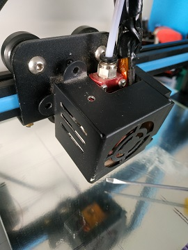
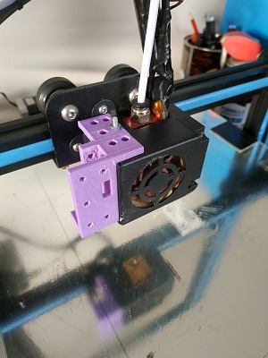
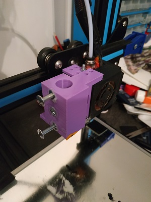
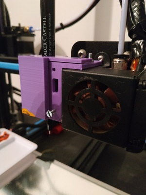
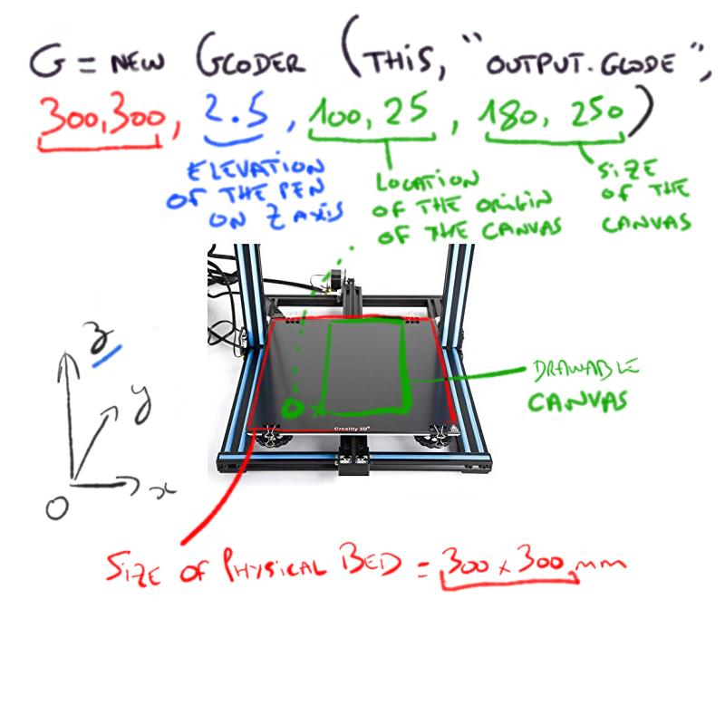
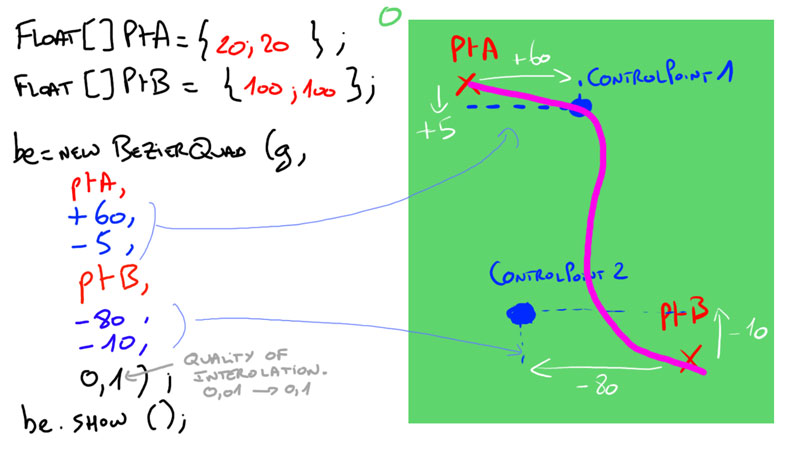
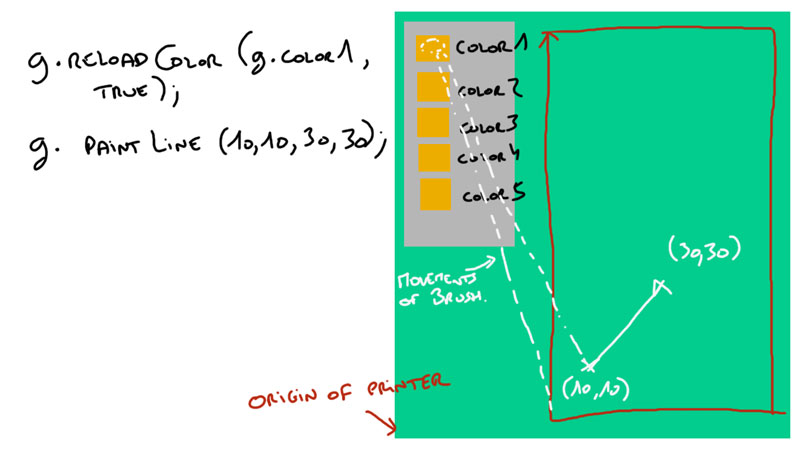
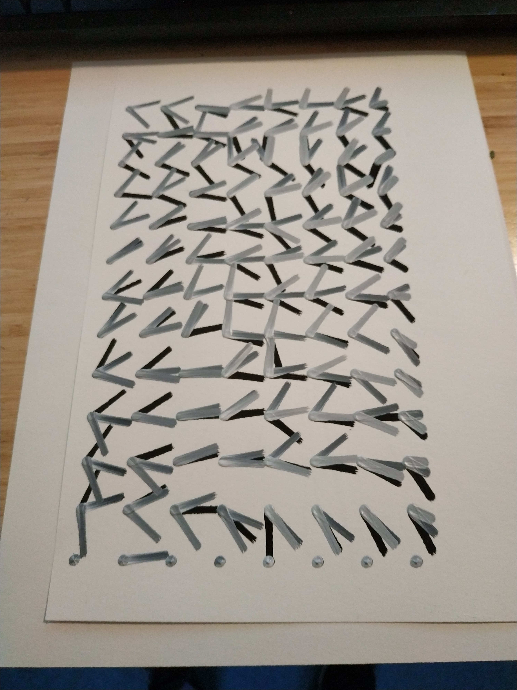
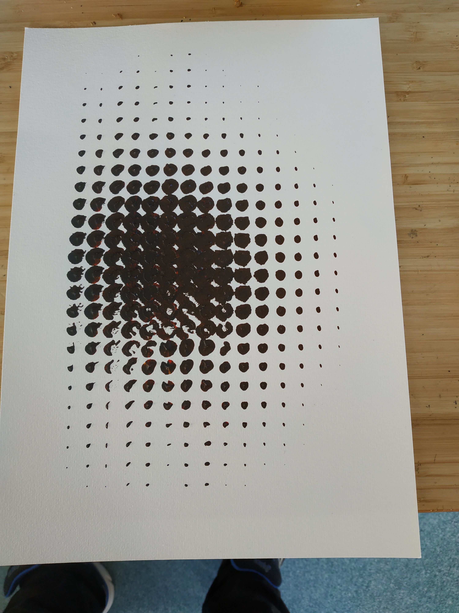

# Processing GCODE for CR10 pen Plotter

_Morgan Thibert -- 2019 -- Library for Processing 3_

## Main

This library aims at easily create gcode file from simple shapes creates within Processing code.

Please see the examples in the examples folder. It is the best way to understand the different functions.

This library was designed for usage with the Creality CR10. I haven't yet tested other printers so if you need to adjust the gcode, you will be have to change it in the source code of this library or make a python script to correct the instructions according to your needs.

***This library is still WorkInProgress. The functions and usage will probably be updated and adjusted in the future.***


## Installation

This repo contains the source code of the library.
The compiled library for installation is here (clone the repo of the link to your processing library folder):
https://github.com/o0morgan0o/gcodeGenerative

*In linux the library location is usually in  ~/sketcbook/libraries/*
*In windows the library location is usually in C:/Users/{User}/Documents/Processing/libraries*


## Pre-requisites

This library aims at transferring processing code to gcode instructions so that it can be send to 3D Printer in order to draw creative coding directly like a pen plotter.

You will need:

-> Basic knowledge of Processing.
-> Print the penHolder which is in the "stl files" folder. This is in 2 parts. you will need to some screws and nuts. And the ensemble need to be fixed to the extruder the best you can. Here is my setup on the CR10.
Of course you can print your own penHolder for better fit with your 3D Printer model.








-> Have a gcode visualizer in order to check if everything seems alright before sending the file to the 3D printer. I use "pronterface" software which is pretty good for this purpose. [pronterface](https://www.pronterface.com/) 

-> Recommended to have basic understanding of GCode instructions. See [this](https://reprap.org/wiki/G-code) for more informations.

## Usage


```java
g = new Gcoder(this, "outputFile", 300,300, 2.5, 100, 25, 193, 278);
// Parameters are PHYSICALLIMITX, PHYSICALLIMITY, amplitudeOnZ, canvasOriginX, canvasOriginY, canvasWidth, canvasHeight
```



> All dimensions are in mm.

Drawing functions:

```java
Line l = new Line(g,0,0, 50,50) // Draw a line from points (0,0) and (50,50)
// or
g.drawLine(0,0,50,50);
```

```java
Rectangle r = new Rectangle(g, 20,20, 50, 40) // Draw a rectangle at (20,20) and of dimensions 50x40mm
// or
g.drawRectangle(20,20, 50,40);
```

___


You can translate or rotate in a "push Matrix" style:

**Important**: Don't use more than one g.pushMatrix() or g.translate(), or g.rotate(), it is not supported for the moment.

```java
for(int i = 0 ; i < 20 ; i+= 4)
g.pushMatrix();
    g.translate(i,30);
    g.rotate(PI /3);
    Rectangle r1 = new Rectangle(0,0, 20,55);
g.popMatrix();
```

At the end of the file you will want to save all the instructions in the gcode file:
```java
// Write to the file
g.writeToFile();
```

### BezierCurves

To make a BezierCurve, make a new BezierQuad, then add points with the method addPoint();

```java
    // define beginning and ending Points.
    float[] pA = {20,20};
    float[] pB = {100,100};
    
    // creation of the bezier Quad by specifing offsets of control points
    be2 = new BezierQuad(g, pA, 20,20, pB , 30,-30, .1);

	// only to see better the control points.
    be2.showControlPoints= true;

	// adding a point to the existing BezierQuad
    float[] pC = {40,120};
    be2.addPoint(pC, 10,10);
    
    
    // show the bezier
    be2.show();
```
Note: The last paremeter of BezierQuad is the quality of interpolation. I recommend to use .01 for better quality of curves, but it generates bigger files and is slower. So .1 is a good compromises when testing.

Visual representation:



## Other useful functions

```java
// Make more pression on the pen during the printing (here -.2 mm means the painting distance on Z is .2mm lower => so it add pressure to the pen)
g.adjustPaintingZ(-.2);

// adjust the speed of drawing and deplacement (the speed must be in mm/min)
g.setSpeed(2400); 

// write a "calibration" gcode file. this file is useful to set up your pen.
// Use this file to set up your pen.
g.writeCalibrationGcode();
```


## Usage with Geomerative

In order to have the possibility to draw with a virtual "fill", I made this library to use with Geomerative Library for processing. Operations are made on the RShapes in order to know which contour should be drawn or not.


### Basic Usage

Please see the geomerative library documentation for more information on the different setPolygonizer options. It impacts the way the shapes are interpolated.
For the best quality according to my tries, choose the following :

```java
// Initialization
RG.init(this);
RG.setPolygonizer(RG.UNIFORMLENGTH);
RG.setPolygonizerLength(1);
```

The filled shapes must all be drawn in a RShape:

```java
RShape rfinal;
rfinal = new RShape();
```

When you want to draw the RShape you can call the function:
```java
g.drawRShape(rfinal);
// or you can specify the resolution as a parameter
g.drawRShape(rfinal, .05);
// the resolution must be between 0 and 1. (best is near 0).
// By default, the resolution passed is 0.01
```

#### Add Filled Rectangle or Ellipse

```java
rfinal = addFilledShape(rfinal, RShape.createRectangle(20,20,100,100));
rfinal = addFilledShape(rfinal, RShape.createEllipse(20,20,100,100));
```


## Experimental features

The features below are more in testing and will probably be modified in the future to have better results.

### 3D Mesh

```java 
    size(1200,1200, P3D);
    
    g=new Gcoder(this,  // necessary
    "output.gcode",  	// name of the output file
    300,				// Physical Limit of the printer on X (300mm for cr10)
    300,				// Physical Limit of the printer on Y (300mm for cr10)
    2.5,				// Z offset between drawing position and moving position
    100,				// X position of the sheet (beginning of the drawing)
    25,					// Y position of the sheet (beginning of the drawing)
    180,				// width of the sheet
    250);				// height of the shee

    canvas = createGraphics((int)g.canvasWidth,(int)g.canvasHeight, P3D); // we will first draw the mesh in a separate PGraphics

    g.addMorePush(.2); // used in order to add some pression to the pen during the drawing. (value in mm)

    m = new GcodeRectMesh(g, this, canvas, new PVector(0, 0, 0), 200,200, 20,20); 
    // pvector(0,0,0) is the position of the pshape
    // 200 is meshwidth
    // 200 is meshheight
    // 20 is number of vertexes per meshwidth
    // 20 is number of vertexes per meshheight

    canvas.beginDraw();
    canvas.pushMatrix();
    canvas.translate(g.canvasWidth/2,g.canvasHeight/2,626);
    canvas.rotateX(0.78147);
    canvas.shape(m.s);
    m.calculate2DProjection(); // it calculate the 2D projection of the 3D space for the drawing.
    m.drawQuads(); // draw the quads and prepare the gcode instructions.
    canvas.popMatrix();
    canvas.endDraw();

 
    g.drawRect(0, 0, g.canvasWidth, g.canvasHeight);
    g.show();
    g.writeToFile(); // write gcode instructions into file
 ```

### Painting

Experimental, you can draw with real paints.
For this use the constructor `GcoderPainting` instead of `Gcoder` and the function used will be `paintLine`, `paintPoint` or `paintRectangle`.

```java
    g=new GcoderPainting(this,  // necessary
    "output",  	// name of the output file
    300,				// Physical Limit of the printer on X (300mm for cr10)
    300,				// Physical Limit of the printer on Y (300mm for cr10)
    2.5,				// Z offset between drawing position and moving position
    150,				// X position of the sheet (beginning of the drawing)
    25,					// Y position of the sheet (beginning of the drawing)
    150,				// width of the sheet
    250);				// height of the sheet

    g.defineZOffsets(0, 3, 15); // use to define, the paintingZ = 0, the reloadZ = 3, the movingZ during reload = 15
    
    g.reloadColor(g.color1, true); //the boolean defines if you want to "shake" the paint during reloading

	// You can use setDrawingStyle to adjust the pression on the pencil
	g.setDrawingStyle("NORMAL", 0.0); // will draw at normal positionZ
	g.paintPoint(50,50);
	
	
	g.setDrawingStyle("NORMAL", 2.0); // will draw at normal positionZ + 2mm
	g.paintPoint(60,50);
	
	g.setDrawingStyle("NORMAL", 0.0);
	g.paintLine(50, 80, 80, 80);

	g.paintRectangle(50, 80, 80, 80, g.color1); //draw a rectangle with reloading painting at each line
	
    g.show();
    g.writeToFile();
```


The position of the colors are hardcoded in my library for testing. If you want to change the position of the colors, you can call the function:

```java
PVector[] colorPositions; // define in this array the positions of your colors in a PVector for each color. (must be 5 colors);
g.defineColorsPosition(colorPositions);

```

Just for information my setup look like this on CR10:


and Some examples:

